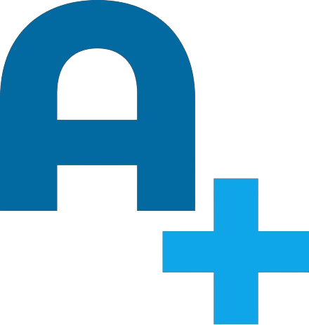
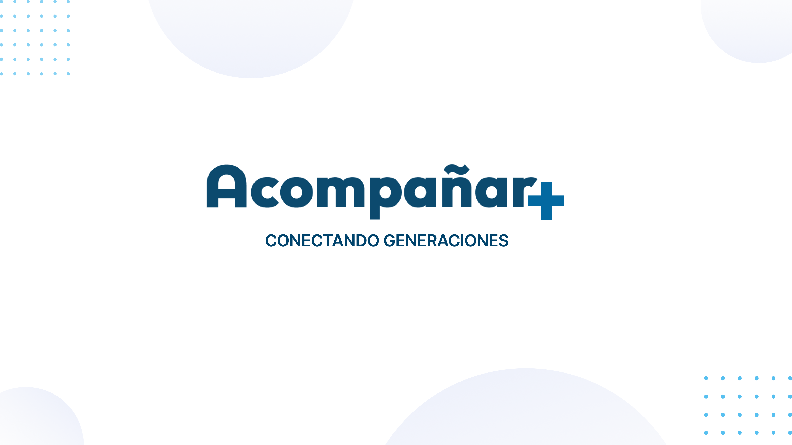

 

<!-- PROJECT LOGO -->
 

# c16-07-m-node-react
Proyecto para simulacion No Country

<h1 align="center"> 
Acompañar+
</h1>

## Demo Video: (Próximamente)

## Problemática

La población de adultos mayores suele experimentar soledad y falta de interacción social, lo que puede afectar su bienestar emocional y físico. Con "Acompañar+", buscamos abordar esta problemática, ofreciendo compañía, actividades estimulantes y conexión con la comunidad para mejorar la calidad de vida de los adultos mayores.

## Objetivo

Nuestro objetivo es promover la compañía y la interacción social entre los adultos mayores, fomentar la actividad física y mental, y brindar apoyo y seguridad a esta comunidad.

## Solución

"Acompañar+" es una solución integral que proporciona compañía, actividades estimulantes y conexión con la comunidad a través de eventos locales. Nuestra aplicación garantiza la seguridad y privacidad de los usuarios mientras promueve una vida activa y socialmente comprometida.

## Objetivos de Desarrollo Sostenible

Adaptando el punto 3 de los Objetivos de Desarrollo Sostenible (ODS) para "Acompañar+":
**ODS 3: Salud y Bienestar**
Garantizar una vida saludable y promover el bienestar para todos en todas las edades, incluida la promoción del bienestar emocional y físico de los adultos mayores a través de actividades sociales y de cuidado personalizado.

<h1 align="center"> 
Documentación
</h1>

<h1 align="center"> 
Tecnologias Usadas
</h1>

<h3>Front-End</h3>

<h3>Back-End</h3>

  <!-- Organización -->
<h1 align="center"> 
Organización
</h1>

<h1 align="center">

</h1>

## Planteo de los POV

**POV1:**
Inés es una adulta mayor a la que le gusta mucho compartir tiempo con otras personas. Su familia vive lejos, por lo que a menudo se encuentra un poco sola. Ella necesita encontrar personas con quienes pasar tiempo porque extraña socializar y le encanta conocer gente nueva

**POV2:**
Andrés es un joven inquieto que siempre busca la manera de estar vinculado con su comunidad. Nota que gran parte de la población es de adultos mayores, pero no sabe bien cómo integrarse a ellos. Necesita saber más sobre esta población porque de esta manera podrá integrarlos en la comunidad y pasar tiempo con ellos.

## MVP (Producto Mínimo Viable)

- Creación de perfil con datos importantes, de contacto y medicación con posibilidad de compartirlo.
- Eventos de la comunidad con propuestas de actividades diarias y visualización de lugares más concurridos.
- Compartir ubicación en tiempo real.
- Sección gamificada con los derechos del adulto mayor.
- Actividades cognitivas con logros e insignias por realizar la actividad del día.

## Backlog

- Usuarios quieren pasar tiempo con un adulto mayor.
- Creación de perfil con preferencias.
- Visualización de eventos de la comunidad.
- Adultos mayores quieren hacer actividades cognitivas.
- Visualización de logros.
- Conocer los derechos del adulto mayor.

<!-- TEAMS -->

<h1 align="center"> 
Equipo
</h1>

<table>
  <tr>
    <td>
      

        
        <a href="https://github.com/aracely33" target="_blank" rel="author">
          <h4 style="margin-top: 1rem;">Aracely Cruz</h4>
          <h4 style="margin-top: 1rem;">BackEnd Developer</h4>
        </a>
        
        
      

    </td>
    <td>
      

        
        <a href="https://github.com/Axel3890" target="_blank" rel="author">
          <h4 style="margin-top: 1rem;">Axel Gomez</h4>
          <h4 style="margin-top: 1rem;">BackEnd Developer</h4>
        </a>
        
        
      

    </td>
        <td>
      

        
        <a href="https://github.com/PerezEnrique" target="_blank" rel="author">
          <h4 style="margin-top: 1rem;">Jesus Enrique Perez</h4>
          <h4 style="margin-top: 1rem;">Backend Developer</h4>
        </a>
        
        
      

    </td>
    <td>
      

        
        <a href="https://github.com/ioskpu" target="_blank" rel="author">
          <h4 style="margin-top: 1rem;">Luis Corales</h4>
          <h4 style="margin-top: 1rem;">Backend Developer</h4>
        </a>
        
        
      

    </td>
  </tr>
</table>

<table>
  <tr>
    <td>
      

        
        <a href="https://github.com/FacKuSalvatierra" target="_blank" rel="author">
          <h4 style="margin-top: 1rem;">Facku Salvatierra</h4>
          <h4 style="margin-top: 1rem;">Frontend Developer</h4>
        </a>
        
        
      

    </td>
    <td>
      

        
        <a href="https://github.com/DiegoLGS" target="_blank" rel="author">
          <h4 style="margin-top: 1rem;">Diego Gloria Salas</h4>
          <h4 style="margin-top: 1rem;">Frontend Developer</h4>
        </a>
        
        
      

    </td>
    <td>
      

        
        <a href="https://github.com/Eliazar08" target="_blank" rel="author">
          <h4 style="margin-top: 1rem;">Eliazar Suarez</h4>
          <h4 style="margin-top: 1rem;">Frontend Developer</h4>
        </a>
        
        
      

    </td>
    <td>
      

        
        <a href="https://github.com/Mauroariza" target="_blank" rel="author">
          <h4 style="margin-top: 1rem;">Mauricio Ariza</h4>
          <h4 style="margin-top: 1rem;">Frontend Developer</h4>
        </a>
        
        
      

    </td>
  </tr>
</table>

<table>
  <tr>
    <td>
      

        
        <a href="https://github.com/Jhairo123" target="_blank" rel="author">
          <h4 style="margin-top: 1rem;">Nico Gomez Reyes</h4>
          <h4 style="margin-top: 1rem;">Frontend Developer</h4>
        </a>
        
        
      

    </td>
    <td>
      

        
        <a href="https://www.behance.net/dirodriguezb?tracking_source=search_users|Ana%20laura%20rodriguez" target="_blank" rel="author">
          <h4 style="margin-top: 1rem;">Ana Laura Rodriguez</h4>
          <h4 style="margin-top: 1rem;">UX/UI Designer</h4>
        </a>
        
        
      

    </td>
    <td>
      

        
        <a href="https://www.behance.net/julianpugliese" target="_blank" rel="author">
          <h4 style="margin-top: 1rem;">Julian Pugliese</h4>
          <h4 style="margin-top: 1rem;">UX/UI Designer</h4>
        </a>
        
        
      

    <td>
  </tr>
</table>

<!-- Screenshots -->
<h1 align="center"> 
Mockups
</h1>

## Contribución

¡Si deseas contribuir a este proyecto, sigue estos pasos!

1. Realiza un fork de este repositorio en tu propia cuenta.
2. Crea una rama para tus cambios.
3. Realiza los cambios y realiza commits con descripciones claras.
4. Envía un pull request a este repositorio con tus cambios.

## Licencia

(desarrollar licencia)

<!-- ACKNOWLEDGMENTS -->

<h3>Agradecimientos</h3>
  

## Contacto

Si tienes alguna pregunta o sugerencia sobre este proyecto, no dudes en ponerte en contacto con nosotros en [correo electrónico](insertar-correo).

---

